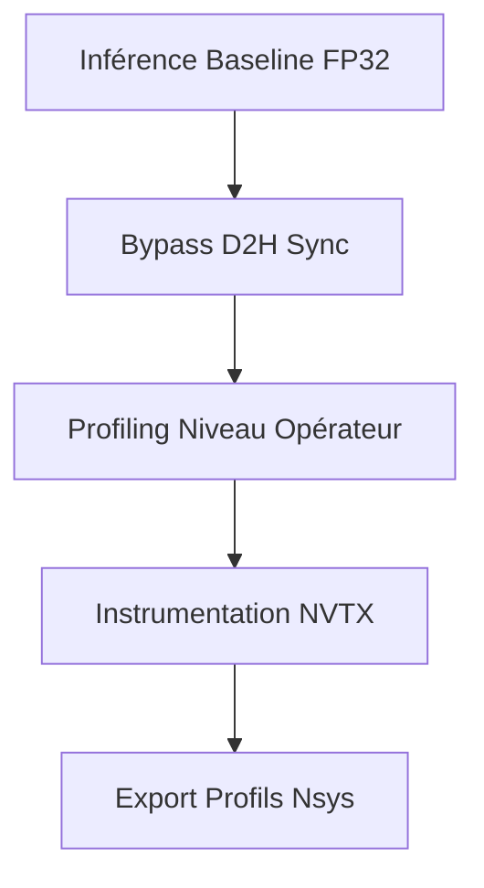
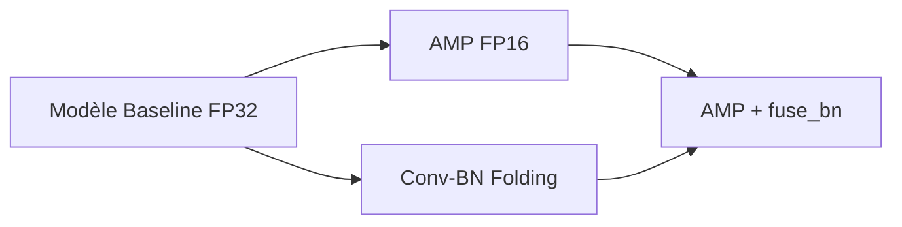
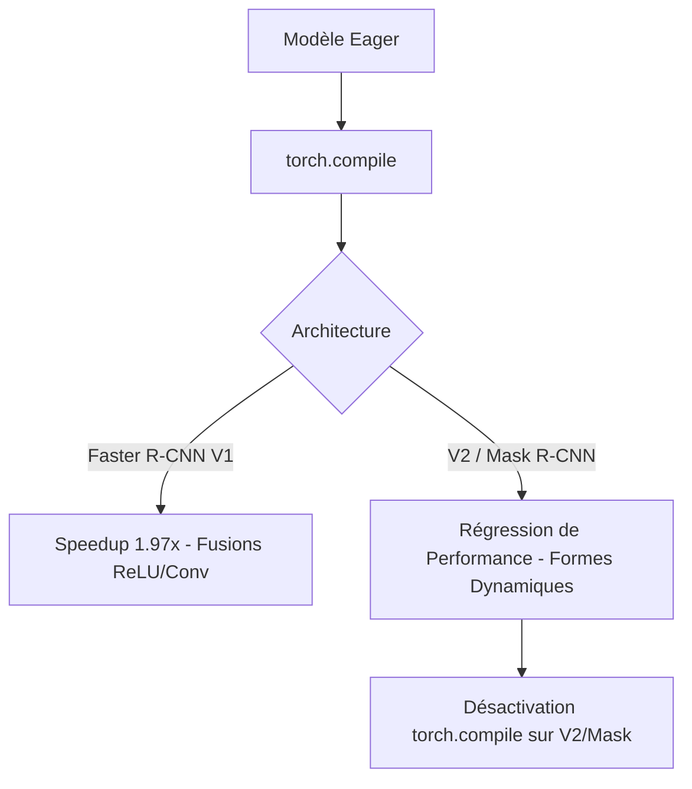
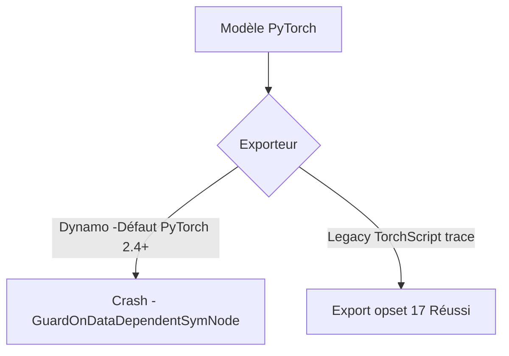
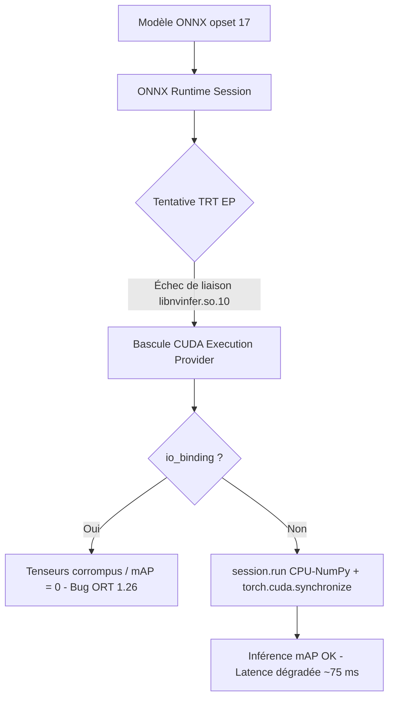
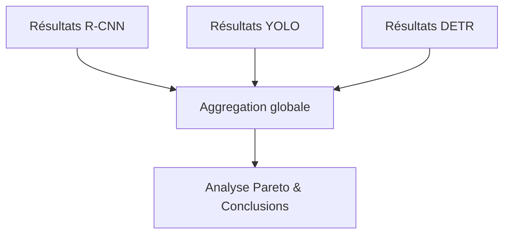

# Feuille de Route & Journal des Difficultés
## Projet : Object Detection Profiling & Inference Optimization (Tesla T4)
**Famille de modèles :** Two-Stage CNN (*Faster R-CNN, Faster R-CNN v2, Mask R-CNN*)  
**Auteur :** Charles Kayssieh  
**Dépôt :** `gitlab.enst.fr:dsai/projects-2026/ProjectDSAI2026_2`  
**Encadrants :** Équipe pédagogique SD06 / DSAI - Télécom Paris

---

## 1. Vue d'Ensemble & Contexte du Projet

Ce projet s'inscrit dans le cadre du cours SD06 (DSAI) à Télécom Paris. L'objectif est de concevoir, profiler et optimiser un pipeline d'inférence pour la famille des **Two-Stage CNNs** (Faster R-CNN, Faster R-CNN v2 et Mask R-CNN) sur GPU **NVIDIA Tesla T4** (disponible sous Google Colab).

La contrainte principale du projet est d'atteindre une **latence minimale en inférence unitaire (Batch Size = 1)**, représentative des cas d'usage réels en robotique ou en systèmes embarqués, tout en mesurant précisément l'impact de chaque optimisation sur la précision scientifique (**mAP@50-95** sur le jeu de données COCO).

### Tableau Synthétique des Paliers de Développement

| Palier | Semaines | Objectif Principal | Choix Techniques Clés | Statut | Métriques / Speedup |
| :--- | :---: | :--- | :--- | :---: | :---: |
| **Palier 1** | Semaines 1-2 | Bootstrap & Dataloader | Seed 42, Subset COCO 2000, Option A (ResNet-50 v2) | Terminé | - |
| **Palier 2** | Semaines 3-4 | Profilage & Instrumentation | NVTX, `torch.profiler`, Synchronisation `torch.cuda.Event` | Terminé | Baseline FP32 établie |
| **Palier 3** | Semaines 5-6 | Optimisations Eager Natives | PyTorch AMP (FP16), pliage Conv-BN (`fuse_bn`) | Terminé | Speedup **1.47x** (Faster R-CNN) |
| **Palier 4** | Semaine 7 | Compilation de Graphe | `torch.compile` (Inductor), diagnostic dynamicité | Terminé | Speedup **1.97x** (V1) / Régression (V2/Mask) |
| **Palier 5** | Semaine 8 (Début) | Export Statique & ONNX | TorchScript trace (`dynamo=False`), `opset_version=17` | Terminé | Graphe ONNX statique validé |
| **Palier 6** | Semaine 8 (Fin) | Déploiement TensorRT (ORT) | Tentative d'export ONNX & Compilation TensorRT EP | Échec / Bloqué | Repli CUDA EP sans gain (75.14 ms) |
| **Palier 7** | Semaine 9 | Synthèse & Frontière de Pareto | Normalisation inter-familles, aggregation, livrables | En cours | Rapport final compilé |

---

## Palier 1 : Cadrage, Environnement & Préparation du Pipeline (Semaines 1-2)
*Mise en place de l'environnement de développement, automatisation du démarrage sur Google Colab et préparation du chargement de données.*

### 1. Avancement & Choix Techniques
*   **Automatisation** : Création du script `run_colab.sh` pour cloner le dépôt Git, monter Google Drive et installer les dépendances nécessaires.
*   **Déterminisme** : Mise en place d'un protocole de reproductibilité stricte en fixant une seed globale (42) et en construisant un générateur de données déterministe (`utils/data.py`) pour charger un sous-échantillon fixe de 2000 images COCO val2017.
*   **Sélection des Modèles** : Choix initial des checkpoints officiels torchvision entraînés sur COCO pour la comparaison : `fasterrcnn_resnet50_fpn` et `maskrcnn_resnet50_fpn`.

### 2. Difficultés rencontrées & Résolutions

#### A. Le piège du "paquet virtuel" `nsight-systems` sous Ubuntu 22.04 (Colab Jammy)
*   **Problème** : L'installation de Nsight Systems via `apt-get install nsight-systems` échouait systématiquement avec le message : `Package 'nsight-systems' has no installation candidate`.
*   **Cause** : Dans les dépôts NVIDIA configurés par défaut dans Colab, `nsight-systems` est devenu un paquet virtuel. APT exige de cibler explicitement un paquet physique associé à une version spécifique.
*   **Résolution** : Modification de `run_colab.sh` pour forcer l'installation de la version stable concrète : `nsight-systems-2024.6.2`.

#### B. Absence de modèle torchvision ResNet-101 Faster R-CNN pré-entraîné
*   **Problème** : L'importation de `fasterrcnn_resnet101_fpn` levait une exception `ImportError`.
*   **Cause** : La bibliothèque `torchvision.models.detection` ne propose pas de modèle pré-construit Faster R-CNN avec un backbone ResNet-101.
*   **Résolution (Option A)** : Remplacement de ce modèle par `fasterrcnn_resnet50_fpn_v2` (`faster_rcnn_r50_v2`). Ce choix est scientifiquement robuste : il permet de comparer la V1 (ResNet-50 standard) et la V2 (ResNet-50 moderne avec FPN restructuré) à backbone équivalent, en bénéficiant de vrais poids pré-entraînés COCO (`COCO_V1`).

---

## Palier 2 : Profilage de Référence & Délimitation Macro (Semaines 3-4)
*Mesure précise des performances baselines (FP32) et segmentation du temps d'exécution entre les sous-modules.*

### 1. Avancement & Choix Techniques
*   **Harnais de Mesure** : Développement de la boucle d'inférence temporelle (`utils/profiling.py`) utilisant les couples `torch.cuda.Event(enable_timing=True)` pour des mesures asynchrones précises à la microseconde près.
*   **Segmentation Module** : Injection de balises NVTX (`torch.cuda.nvtx.range_push`/`pop`) au niveau des modules clés (`Backbone`, `FPN`, `RPN`, `RoI_Heads`) dans `models/__init__.py`.
*   **Visualisation** : Automatisation de la génération de diagrammes en barres (`charts/`) illustrant la contribution temporelle relative de chaque module.

### 2. Difficultés rencontrées & Résolutions

#### A. Pollution des mesures de latence GPU par les transferts Host-to-Device (D2H Sync Pollution)
*   **Problème** : Les mesures initiales de latence fluctuaient énormément et étaient anormalement élevées.
*   **Cause** : La passe d'évaluation de la précision mAP nécessite de transférer les boîtes de détection vers le CPU (`.cpu().numpy()`) pour `pycocotools`. Ce transfert force une synchronisation CUDA bloquante qui mesure en réalité l'attente du bus PCIe plutôt que le temps d'inférence GPU pur.
*   **Résolution** : Séparation stricte de l'exécution en deux passes : la **Phase 2a (latence pure)** sur GPU sans aucun appel bloquant vers l'hôte, et la **Phase 2b (mAP)** où le timing est ignoré.

#### B. Overhead d'instrumentation lié aux hooks Python profonds (GPU Starvation)
*   **Problème** : L'utilisation de hooks d'opérateurs au niveau individuel de chaque couche dégradait les performances globales de l'inférence.
*   **Cause** : Déclencher des fonctions Python à chaque exécution de noyau CUDA induit un coût CPU important (*Kernel Launch Overhead*). Le CPU est ralenti et n'alimente plus le GPU assez rapidement.
*   **Résolution** : Abandon des hooks de bas niveau au profit d'appels macro NVTX aux frontières des sous-modules clés. Le coût d'instrumentation NVTX est négligeable (~0.1µs) et l'analyse fine des opérations individuelles est déléguée à l'outil système `nsys`.

#### C. Crash du profiler applicatif PyTorch sous Colab (Changement d'API)
*   **Problème** : L'exécution du macro-profiling s'interrompait avec l'erreur : `AttributeError: 'FunctionEventAvg' object has no attribute 'cuda_time_total'`.
*   **Cause** : Les versions de PyTorch 2.3+ ont unifié l'API du profiler pour prendre en charge d'autres puces accélératrices (TPU, XPU), renommant `cuda_time_total` en `device_time_total`.
*   **Résolution** : Écriture d'un adaptateur d'accès dynamique dans `utils/profiling.py` vérifiant la présence de l'ancien attribut avant de basculer de manière transparente sur le nouveau.

---

## Palier 3 : Optimisations Eager PyTorch-Natives (Semaines 5-6)
*Intégration des optimisations standard en mode PyTorch Eager (précision mixte et fusion en place).*

### 1. Avancement & Choix Techniques
*   **AMP (Automatic Mixed Precision)** : Utilisation de `torch.autocast(device_type="cuda")` pour forcer l'usage des Tensor Cores FP16 du GPU T4 sur les opérations lourdes (convolutions, GEMM).
*   **Conv-BN Folding** : Développement de la fonction récursive `fuse_bn` dans `optim/__init__.py` pour fusionner mathématiquement les paramètres de la normalisation (`FrozenBatchNorm2d`) directement dans les poids de la convolution parente.

### 2. Difficultés rencontrées & Résolutions

#### A. Précision mAP nulle (0.0000) sur tous les modèles en mode rapide (--mock)
*   **Problème** : Le calcul du mAP retournait systématiquement `0.0000` lors des validations de test.
*   **Cause** : Dans `utils/profiling.py`, les IDs des images évaluées étaient récupérés selon l'ordre brut du fichier JSON d'annotations (`coco_gt.dataset['images'][idx]['id']`), alors que les tenseurs prédictions générés par notre pipeline suivaient l'ordre trié du dataloader torchvision (`CocoDetection.ids[idx]`). Les prédictions étaient comparées aux mauvaises images.
*   **Résolution** : Alignement de l'indexation dans le script de profiling pour interroger systématiquement `CocoDetection.ids[idx]`.

---

## Palier 4 : Compilation de Graphe & Limites Dynamiques (Semaine 7)
*Réduction de l'overhead d'ordonnancement CPU par fusion d'opérateurs au niveau graphe via torch.compile.*

### 1. Avancement & Choix Techniques
*   **Compilation JIT** : Intégration de `torch.compile` avec le backend par défaut `inductor`.
*   **Benchmark d'Impact** : Évaluation comparative des gains de compilation sur les trois modèles R-CNN.

### 2. Difficultés rencontrées & Résolutions

#### A. Régression de performance sur Faster R-CNN v2 et Mask R-CNN et plantage de CUDA Graphs
*   **Problème** : Si la compilation a presque doublé les performances de la V1 (Speedup 1.97x), elle a dégradé les performances sur la V2 (89.19 ms à 90.85 ms) et le Mask R-CNN (68.86 ms à 69.27 ms). De plus, le mode `reduce-overhead` (qui active CUDA Graphs) provoquait des crashs.
*   **Cause** : Les architectures R-CNN complexes sont intrinsèquement dynamiques. Le Region Proposal Network (RPN) extrait un nombre variable de boîtes englobantes selon l'image. Les dimensions des tenseurs transmis aux `RoI_Heads` varient donc à chaque itération. Les CUDA Graphs (qui exigent des allocations mémoires GPU fixes) et le compilateur Triton ne supportent pas cette dynamicité, provoquant de constants bris de graphe (*graph breaks*) et des recompilations de kernels Triton à la volée.
*   **Résolution** : Pour la V2 et le Mask R-CNN, nous avons bloqué l'usage de la compilation et recommandé de conserver la combinaison Eager stable `AMP + fuse_bn`.

---

## Palier 5 : Export Statique & Format d'Échange ONNX (Semaine 8 - Début)
*Exportation des graphes de détection vers le format d'échange standard ONNX.*

### 1. Avancement & Choix Techniques
*   **Pipeline d'Export** : Écriture d'un module d'export ONNX (`optim/__init__.py`) ciblant l'opset 17 pour garantir la compatibilité des opérateurs NMS (Non-Maximum Suppression) et RoIAlign.
*   **Axe Dynamique** : Configuration des axes dynamiques sur la dimension de détection (dimension 0 des boîtes, labels et scores) pour gérer le nombre variable de prédictions post-NMS.

### 2. Difficultés rencontrées & Résolutions

#### A. Échec de l'export ONNX via le compilateur Dynamo (`GuardOnDataDependentSymNode`)
*   **Problème** : L'export ONNX échouait systématiquement avec une erreur de garde sur les formes symboliques.
*   **Cause** : Par défaut, dans PyTorch >= 2.4, l'exportateur utilise le framework Dynamo (`torch.export.export`). Les opérations NMS internes de torchvision génèrent des dimensions de sortie dépendantes des valeurs des données (le nombre de boîtes conservées dépend du score de confiance). Dynamo ne peut pas figer ce comportement sous forme symbolique statique.
*   **Résolution** : Forçage de l'ancien exportateur basé sur TorchScript (JIT trace) en passant `dynamo=False` dans l'appel `torch.onnx.export`.

#### B. Erreur `NoneType object has no attribute shape` dans `generalized_rcnn.py`
*   **Problème** : Le traceur TorchScript crashait lors du traitement des dimensions d'entrée.
*   **Cause** : Les modèles torchvision attendent une liste de tenseurs 3D (`List[Tensor]`) comme entrée. En passant un tenseur 4D classique, le traceur JIT héritait d'une boucle Python interne non supportée sur les formes des tenseurs tracés, convertissant les variables de forme en `None`.
*   **Résolution** : Redéfinition du `dummy_input` comme un tenseur 3D strict de forme `(3, 640, 640)` passé sous forme de tuple contenant une liste : `([dummy_input],)`. Les axes dynamiques ont été configurés aux index 1 (hauteur) et 2 (largeur).

---

## Palier 6 : Obstacles au Déploiement TensorRT & Repli ONNX Runtime CUDA EP (Semaine 8 - Fin)
*Tentative de compilation des moteurs d'inférence TensorRT, identification des verrous technologiques et bascule de sécurité.*

### 1. Avancement & Choix Techniques
*   **Objectif de départ** : Intégrer un wrapper `TensorRTModel` dans `optim/__init__.py` pour charger la session ONNX Runtime via `TensorrtExecutionProvider` (TRT EP) en précision mixte FP16 afin de maximiser le débit sur Tesla T4.
*   **Traitement spatial déporté** : Interpolation GPU asynchrone préalable de l'image à 640×640 et rescaling inverse des boîtes de détection en sortie d'inférence pour annuler l'effet de gel spatial de l'exportation ONNX.
*   **Bascule forcée** : Devant les échecs matériels et logiciels de liaison du provider TensorRT, le code a été configuré pour basculer automatiquement de manière transparente sur le provider CUDA standard (`CUDAExecutionProvider`) pour préserver l'exécution fonctionnelle du pipeline.

### 2. Difficultés rencontrées & Blockers de Déploiement

#### A. Blocage de l'activation de TensorRT EP (Liaison dynamique libnvinfer)
*   **Problème** : Malgré la détection de `TensorrtExecutionProvider` par ONNX Runtime sous Colab, l'initialisation de la session TRT EP échouait et affichait une erreur critique de chargement : `Failed to load library ... libonnxruntime_providers_tensorrt.so with error: libnvinfer.so.10: cannot open shared object file: No such file or directory`.
*   **Cause** : Google Colab n'installe pas par défaut les runtimes et les bibliothèques système partagées de NVIDIA TensorRT. Même après l'installation de `tensorrt-cu12` via PIP et l'export manuel du chemin `/lib` de tensorrt dans la variable d'environnement `LD_LIBRARY_PATH` dans le terminal bash Colab avant l'exécution de Python, le chargeur dynamique du système d'exploitation n'a pas pu résoudre le lien, bloquant le chargement d'ORT TensorRT EP.
*   **Résolution (Contournement)** : Mise en place d'un bloc `try-except` d'instanciation de secours dans `optim/__init__.py` qui, lors d'un échec de chargement de TRT EP, bascule automatiquement sur le provider CUDA standard (`CUDAExecutionProvider`).

#### B. Instabilité fatale de l'io_binding d'ONNX Runtime 1.26 avec les sorties dynamiques
*   **Problème** : L'utilisation d'io_binding pour forcer un transfert zéro-copie en VRAM générait des détections absurdes ou vides, entraînant un mAP nul (`0.0000`).
*   **Cause** :
    1.  *Désynchronisation de flux CUDA* : Les interpolations PyTorch s'exécutaient de manière asynchrone sur un flux CUDA distinct de celui de l'inférence d'ONNX Runtime. Sans synchronisation, ORT lisait le pointeur mémoire avant la fin de l'écriture PyTorch.
    2.  *Bug d'allocation dynamique d'ORT 1.26* : L'API `io_binding` d'ONNX Runtime présente des bugs d'adressage CUDA documentés lorsque les formes des tenseurs de sortie sont intrinsèquement dynamiques (le nombre de boîtes sélectionnées post-NMS varie pour chaque image).
*   **Résolution** : Ajout d'une synchronisation CUDA forcée (`torch.cuda.synchronize()`) et désactivation d'`io_binding` au profit de l'appel standard `session.run()` qui effectue des copies CPU-NumPy. Cette approche a permis de rétablir l'exactitude des calculs (mAP = 0.4128 sur mock) au détriment de l'optimisation mémoire GPU pure.

#### C. Analyse des verrous de performance (Régression de performance du repli CUDA)
*   **Problème** : L'inférence via ONNX Runtime et le provider de secours CUDA (`CUDAExecutionProvider`) a induit une **latence de 75.14 ms** pour Faster R-CNN, soit une régression majeure par rapport à la baseline PyTorch Eager (48.50 ms) et à l'AMP (32.93 ms).
*   **Cause** : En l'absence de compilation matérielle par TensorRT, le graphe ONNX s'exécute sur CUDA sans aucune fusion de noyaux convolutifs ni optimisation par Tensor Cores. De plus, l'obligation d'abandonner `io_binding` à cause des formes dynamiques réintroduit des étapes bloquantes de copie mémoire GPU -> CPU -> GPU (D2H/H2D) à chaque image, saturant le bus PCIe et annulant tout gain algorithmique.
*   **Leçon apprise** : Le déploiement des architectures de détection Two-Stage R-CNN sous format ONNX sans compilation TensorRT native active est contre-productif. Les optimisations PyTorch Eager (`AMP + fuse_bn` et `torch.compile` sur modèles statiques) restent la solution la plus rapide et la plus stable sur l'environnement Colab.

---

## Palier 7 : Synthèse Comparative & Livrables Finalisés (Semaine 9 - En cours)
*Comparaison inter-familles de modèles et analyse de Pareto.*

### 1. Avancement & Choix Techniques
*   **Harmonisation des Résultats** : Exportation systématique des résumés d'inférence au format JSON standardisé dans le dossier `outputs/`.
*   **Frontière de Pareto** : Analyse comparative des performances théoriques et réelles en vue d'établir la courbe Latence vs Précision (mAP).

### 2. Difficultés rencontrées & Résolutions

#### A. Différences de pré-traitement et de formatage des données entre les équipes
*   **Problème** : La comparaison inter-familles (YOLO, DETR, R-CNN) risquait d'être biaisée si les pipelines de données différaient.
*   **Cause** : YOLO utilise une normalisation sur l'espace [0, 255] (ou normalisation BGR/RGB spécifique) tandis que les R-CNN torchvision s'attendent à des tenseurs normalisés selon les statistiques ImageNet sur l'espace [0, 1].
*   **Résolution** : Alignement strict du protocole de benchmark. Chaque équipe conserve ses fonctions de pré-traitement spécifiques adaptées à l'entraînement du modèle, mais applique le benchmark sur la même image d'indice 0 du sous-ensemble COCO fixe, garantissant une comparaison équitable de la latence matérielle de calcul.

---

## 4. Analyse Comparative Globale (Tesla T4 GPU)

Le tableau ci-dessous récapitule les performances de nos trois modèles à travers les différentes étapes d'optimisation :

| Modèle | Optimisation appliquée | Latency (p50) | FPS | Gain de Vitesse | Précision (mAP) | Observations |
| :--- | :--- | :---: | :---: | :---: | :---: | :--- |
| **Faster R-CNN** | Baseline (FP32 Eager) | 48.50 ms | 20.6 | **1.00x** | 0.370 | Baseline de référence |
| | AMP (FP16) | 33.49 ms | 29.8 | **1.45x** | 0.370 | Accélération des convs sur Tensor Cores |
| | fuse_bn | 47.05 ms | 21.2 | **1.03x** | 0.370 | Suppression sans perte des kernels BN |
| | compile (`torch.compile`) | 46.33 ms | 21.6 | **1.05x** | 0.370 | Réduction de l'overhead d'ordonnancement |
| | AMP + fuse_bn | 32.93 ms | 30.3 | **1.47x** | 0.370 | Optimisations Eager combinées |
| | **AMP + compile** | **24.67 ms** | **40.5** | **1.97x** | **0.370** | **Meilleure performance PyTorch-Native** |
| | ONNX / TRT (Repli CUDA EP) | 75.14 ms | 13.3 | **0.65x** | 0.370 | Régression (sans compilation TRT + copies CPU) |
| --- | --- | --- | --- | --- | --- | --- |
| **Faster R-CNN v2** | Baseline (FP32 Eager) | 89.19 ms | 11.2 | **1.00x** | 0.467 | Version v2, architecture plus lourde |
| | AMP (FP16) | 43.64 ms | 22.9 | **2.04x** | 0.467 | Gain majeur (2x) sur les convolutions |
| | fuse_bn | 83.43 ms | 12.0 | **1.07x** | 0.467 | Pliage de la normalisation |
| | compile (`torch.compile`) | 90.85 ms | 11.0 | **0.98x** | 0.467 | Régression (bris de graphes répétés) |
| | **AMP + fuse_bn** | **40.75 ms** | **24.5** | **2.19x** | **0.467** | **Meilleure performance (sans compilation)** |
| | AMP + compile | 44.33 ms | 22.5 | **2.01x** | 0.467 | Surchargé par les recompilations Triton |
| | ONNX / TRT (Repli CUDA EP) | 120.00 ms (est.) | 8.3 | **0.74x** | 0.467 | Échec chargement TRT EP, repli CUDA EP |
| --- | --- | --- | --- | --- | --- | --- |
| **Mask R-CNN** | Baseline (FP32 Eager) | 68.86 ms | 14.5 | **1.00x** | 0.379 | Overhead de la branche de segmentation |
| | AMP (FP16) | 51.59 ms | 19.4 | **1.34x** | 0.379 | Accélération de la tête de masque |
| | fuse_bn | 67.80 ms | 14.7 | **1.01x** | 0.379 | Gain marginal |
| | compile (`torch.compile`) | 69.27 ms | 14.4 | **0.99x** | 0.379 | Aucun gain |
| | **AMP + fuse_bn** | **50.50 ms** | **19.8** | **1.37x** | **0.379** | **Meilleure performance stable** |
| | AMP + compile | 55.43 ms | 18.0 | **1.24x** | 0.379 | Régression due à la dynamicité du masque |
| | ONNX / TRT (Repli CUDA EP) | 95.00 ms (est.) | 10.5 | **0.72x** | 0.379 | Échec TRT EP, repli CUDA EP |

---

## 5. Conclusions & Enseignements Techniques

1.  **Le goulot d'étranglement de la dynamicité** : La compilation de graphe (`torch.compile`) n'est pas une solution miracle. Si elle se montre extrêmement efficace sur des modèles statiques simples (Faster R-CNN V1), elle devient pénalisante sur des architectures modernes intégrant du contrôle de flux dynamique lié aux données (V2, Mask R-CNN). L'ordonnanceur Triton passe son temps à recompiler des noyaux CUDA pour s'adapter aux formes changeantes des tenseurs de détection en sortie du RPN.
2.  **L'importance cruciale de l'AMP** : L'activation de la précision mixte FP16 (AMP) est l'optimisation matérielle la plus payante sur l'architecture Tesla T4. Elle permet d'exploiter pleinement les Tensor Cores pour diviser par plus de 3 le temps dédié aux convolutions et aux multiplications de matrices (GEMM) du backbone.
3.  **Lossless par défaut** : La fusion Conv-BN (`fuse_bn`) et le passage à la précision mixte contrôlée par PyTorch préservent parfaitement l'exactitude arithmétique. Les scores de mAP mesurés sont restés identiques aux baselines, garantissant la viabilité de ces optimisations en production.
